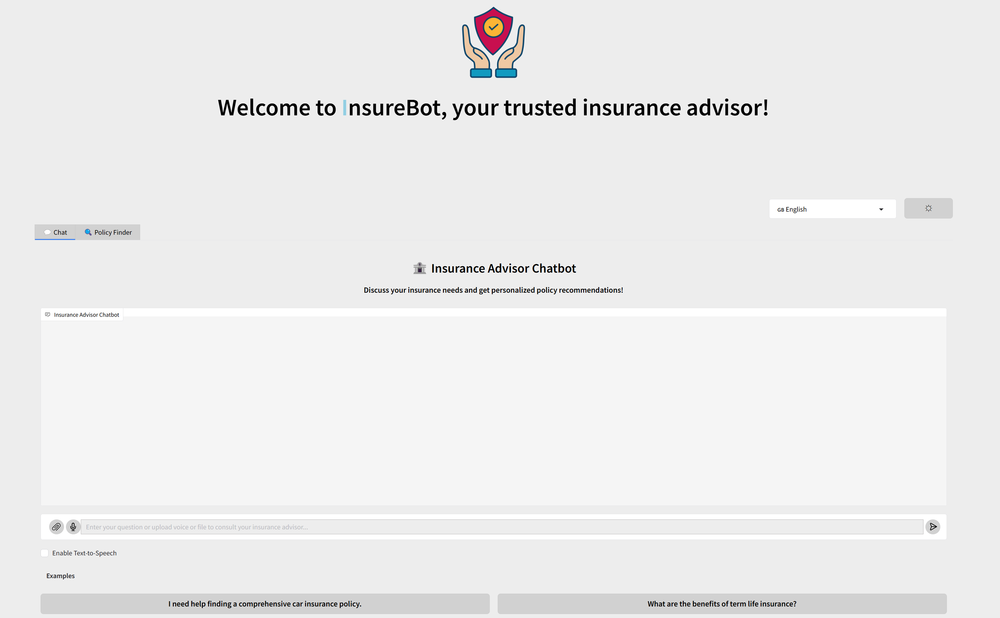

# InsureBot: Insurance Advisor Chatbot


A powerful, interactive chatbot designed to provide personalized insurance advice in multiple languages. InsureBot features a conversational interface with advanced file handling capabilities, multilingual support, and a sleek, responsive design with light/dark mode.
https://huggingface.co/spaces/NiceGuy101/chatbox

## 🌟 Features

- **Interactive Chat Interface**: Have natural conversations about insurance products and needs
- **Policy Finder Tool**: Generate tailored insurance policy recommendations
- **Multilingual Support**: Currently supports English and French with easy extensibility
- **Dark/Light Theme**: Toggle between visual themes for comfortable viewing
- **File Upload & Processing**: Upload and analyze insurance documents in various formats
- **Text-to-Speech**: Listen to chatbot responses with natural-sounding voices
- **Voice Input**: Speak directly to the chatbot using your microphone
- **Mobile Responsive**: Works seamlessly across devices and screen sizes

## 📊 Demo


*Screenshot of the InsureBot interface showing both chat and policy finder features*

## 🚀 Installation

1. Clone the repository:
   ```bash
   git clone https://github.com/brunokazadi/insurance-advisor-chatbot.git
   cd insurance-advisor-chatbot
   ```

2. Create a virtual environment and activate it:
   ```bash
   python -m venv venv
   source venv/bin/activate  # On Windows, use: venv\Scripts\activate
   ```

3. Install dependencies:
   ```bash
   pip install -r requirements.txt
   ```

4. Set up your environment variables:
   ```bash
   # Create a .env file with your API keys
   GROQ_API_KEY=your_groq_api_key_here
   ```

## 💻 Usage

1. Run the application:
   ```bash
   python app.py
   ```

2. Open your browser and navigate to:
   ```
   http://127.0.0.1:7860
   ```

3. Start chatting with InsureBot or use the Policy Finder to get tailored recommendations.

## 📁 Project Structure

```
insurance-advisor-chatbot/
├── app.py               # Main application entry point
├── utils.py             # Business logic and helper functions
├── static.py            # CSS styles and JavaScript functionality
├── requirements.txt     # Project dependencies
├── README.md            # Project documentation
└── .env                 # Environment variables (create this file)
```

## 🛠️ Technology Stack

- **Backend**: Python 3.x
- **UI Framework**: Gradio
- **LLM Integration**: Groq API (llama-3.3-70b-versatile, llama3-70b-8192)
- **Speech Recognition**: Google Speech Recognition API
- **Text-to-Speech**: gTTS (Google Text-to-Speech)
- **Document Processing**: PyPDF2, python-docx
- **Frontend**: HTML, CSS, JavaScript

## 📋 Key Components

### Chatbot Engine
InsureBot uses Groq's LLM APIs to power its conversational capabilities, offering expert advice on insurance topics including auto, home, life, and health insurance.

### Policy Finder
The Policy Finder tool collects specific requirements including insurance type, coverage amount, budget, and more to generate tailored insurance policy recommendations.

### File Processing
Upload insurance policies, contracts, or other relevant documents in PDF, DOCX, or TXT formats. InsureBot will analyze these documents and provide insights.

### Multilingual Support
Easily switch between languages through the dropdown. The system currently supports English and French but is designed to be easily expanded to support additional languages.

## 🌐 Multilingual Support

InsureBot currently supports:
- 🇬🇧 English
- 🇫🇷 French

To add additional languages:
1. Add a new language key to the `TRANSLATIONS` dictionary in `utils.py`
2. Add the corresponding insurance types to `INSURANCE_TYPES`
3. Update the language dropdown choices in the UI

## 🎨 Customization

### Theme Customization
Modify the CSS in the `STYLE` variable in `static.py` to adjust colors, spacing, and other visual elements.

### Adding Insurance Types
Update the `INSURANCE_TYPES` dictionary in `utils.py` to add or modify insurance types for each supported language.

### Expanding Response Generation
The chatbot's response generation can be customized by modifying the system prompts in `chat_with_bot_stream` and `generate_policy_recommendation` functions in `utils.py`.

## ⚙️ API Configuration

InsureBot uses the Groq API for language model capabilities. You'll need to:

1. Sign up for a Groq account at [groq.com](https://groq.com)
2. Get your API key from the dashboard
3. Add the API key to your `.env` file or directly in the code (for testing only)

## 📄 License

This project is licensed under the MIT License - see the LICENSE file for details.

## 👥 Contributing

Contributions are welcome! Please feel free to submit a Pull Request.

1. Fork the repository
2. Create your feature branch (`git checkout -b feature/amazing-feature`)
3. Commit your changes (`git commit -m 'Add some amazing feature'`)
4. Push to the branch (`git push origin feature/amazing-feature`)
5. Open a Pull Request

## 🙏 Acknowledgements

- [Groq](https://groq.com) for their powerful LLM API
- [Gradio](https://gradio.app/) for the interactive UI framework
- Icon credits: [Insurance Icon](https://github.com/brunokazadi/insurance-advisor-chatbot)
